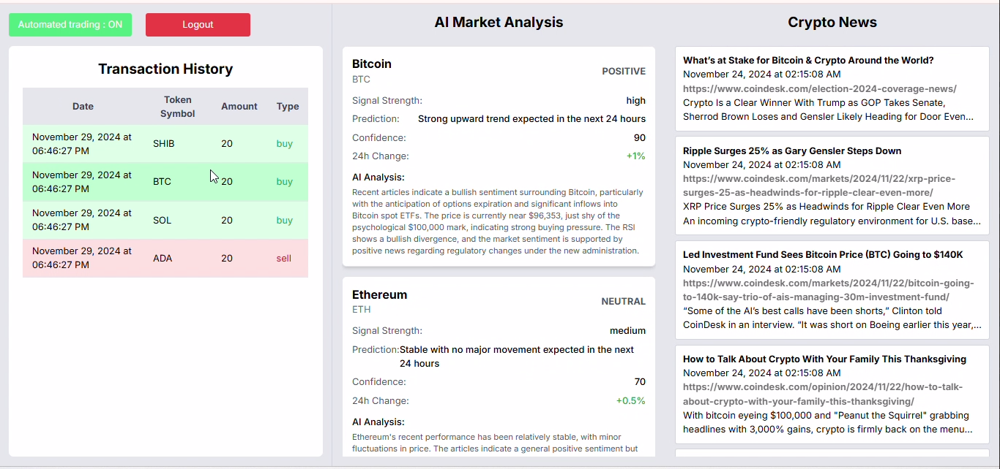

# Crypto Insight

**Crypto Insight** is a comprehensive web application designed to streamline crypto news aggregation, sentiment analysis, and automated trading. Built with cutting-edge AI and blockchain technologies, it provides users with actionable insights and tools for informed crypto trading decisions.

## Features

- **News Crawling**: Automatically fetch crypto-related articles from multiple trusted sources every 30 minutes.
- **AI Sentiment Analysis**: Leverage Cono AI from Arcanic AI to identify mentioned cryptocurrencies and assign a sentiment score (1-100) for each article.
- **Crypto Wallet Integration**: Allow users to log in with their crypto wallets and manage their trading history securely.
- **Automated Trading**: Execute buy/sell decisions on the blockchain based on AI recommendations.

## Tech Stack Overview

- **Next.js**: Version 20 or newer (for frontend development).
- **Node.js**: Version 18 or newer 
- **MySQL**: For managing login data.
- **Python**: For the Crawl Service (with FastAPI framework).
- **Docker**: For containerized deployment.
- **Ethers.js**: For blockchain integration and smart contract interaction.
- **Metamask or Web3-compatible Wallet**: For cryptocurrency transactions.
- **Cono AI**: For sentiment analysis and trading decision-making.

## Tech Stack

This repository contains the code for both the frontend and backend of Crypto Insight.

- **Crawl Crypto News Service**: Written in Python, using the FastAPI framework for efficient web scraping of crypto news.
- **Buy/Sell Service**: Built with JavaScript running on Node.js, using the Express.js.
- **Schedule Service**: Written in TypeScript, running on Node.js with the NestJS framework, and uses MySQL for data management.
- **AI Integration**: Cono API from Arcanic AI for sentiment analysis and trading decision-making.
- **Blockchain Integration**: Web3.js for wallet connectivity and smart contract interaction.

## Screenshot
 

## Contributing
We welcome contributions! If you’d like to contribute, please follow our contribution guidelines in [CONTRIBUTING.md](CONTRIBUTING.md).

## Security
If you identify a security vulnerability, please responsibly disclose it by emailing us at [hello@arcanic.ai](mailto:hello@arcanic.ai). Avoid opening public issues regarding vulnerabilities.

## License
Crypto Insight is open-source software developed by Arcanic AI. If you have any questions or would like to propose a different licensing model, please contact us at [hello@arcanic.ai](mailto:hello@arcanic.ai).  
By contributing to Crypto Insight, you agree that your contributions will be considered for inclusion in the project and will be governed by the licensing terms set by Arcanic AI.

